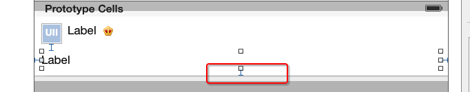

#纯代码创建
##frame
- 一.给模型增加frame数据
 - 所有子控件的frame
 - cell的高度

```objc
@interface Status : NSObject
/**** 文字\图片数据 ****/
// .....

/**** frame数据 ****/
/** 头像的frame */
@property (nonatomic, assign) CGRect iconFrame;
// .....
/** cell的高度 */
@property (nonatomic, assign) CGFloat cellHeight;
@end
```

- 二.重写模型cellHeight属性的get方法

```objc
- (CGFloat)cellHeight
{
    if (_cellHeight == 0) {
        // ... 计算所有子控件的frame、cell的高度
    }
    return _cellHeight;
}
```

-  三.在控制器中
 - 实现一个返回cell高度的代理方法
    - 在这个方法中返回indexPath位置对应cell的高度

```objc
/**
 *  返回每一行cell的具体高度
 */
- (CGFloat)tableView:(UITableView *)tableView heightForRowAtIndexPath:(NSIndexPath *)indexPath
{
    Status *status = self.statuses[indexPath.row];
    return status.cellHeight;
}
```

-  四. 给cell传递模型数据

```objc
- (UITableViewCell *)tableView:(UITableView *)tableView cellForRowAtIndexPath:(NSIndexPath *)indexPath
{
    static NSString *ID = @"tg";
    // 访问缓存池
    StatusCell *cell = [tableView dequeueReusableCellWithIdentifier:ID];

    // 设置数据(传递模型数据)
    cell.status = self.statuses[indexPath.row];

    return cell;
}
```

- 五 新建一个继承自`UITableViewCell`的子类，比如StatusCell
```objc
@interface StatusCell : UITableViewCell
@end
```
- 六 在StatusCell.m文件中
 - 重写`-initWithStyle:reuseIdentifier:`方法
    - 在这个方法中添加所有需要显示的子控件
    - 给子控件做一些初始化设置（设置字体、文字颜色等）

```objc
/**
 *  在这个方法中添加所有的子控件
 */
- (instancetype)initWithStyle:(UITableViewCellStyle)style reuseIdentifier:(NSString *)reuseIdentifier
{
    if (self = [super initWithStyle:style reuseIdentifier:reuseIdentifier]) {
        // ......
    }
    return self;
}
```

- 七 在StatusCell.h文件中提供一个模型属性，比如XMGTg模型
```objc
@class Status;

@interface StatusCell : UITableViewCell
/** 团购模型数据 */
@property (nonatomic, strong) Status *status;
@end
```

- 八 在TgCell.m中重写模型属性的set方法
- 在set方法中给子控件设置模型数据

```objc
- (void)setStatus:(Status *)status
{
    _status = status;

    // .......
}
```

- 九 重写`-layoutSubviews`方法
- 一定要调用`[super layoutSubviews]`
- 在这个方法中设置所有子控件的frame

```objc
/**
 *  在这个方法中设置所有子控件的frame
 */
- (void)layoutSubviews
{
    [super layoutSubviews];

    // ......
}
```


#storyBoard创建

## 对比自定义等高cell，需要几个额外的步骤（iOS8开始才支持）
- 添加子控件和contentView之间的间距约束



- 设置tableViewCell的真实行高和估算行高

```objc
// 告诉tableView所有cell的真实高度是自动计算（根据设置的约束来计算）
self.tableView.rowHeight = UITableViewAutomaticDimension;
// 告诉tableView所有cell的估算高度
self.tableView.estimatedRowHeight = 44;
```


- 根据文段最后底部结尾,可以利用autolayout的约束进行控制,
设置与底部的长度的约束,如果是图片的话,要想不显示图片,可以利用约束控制这图片的大小,注意如果是label的话,控制大小成线也会有些影响.

```obj
    if (status.picture) { // 有配图
        self.pictureHeight.constant = 100;
        self.pictureBottom.constant = 10;
        self.pictureImageView.image = [UIImage imageNamed:status.picture];
    } else { // 没有配图
        // 设置图片高度为0
        self.pictureHeight.constant = 0;
        // 设置图片底部间距为0
        self.pictureBottom.constant = 0;

```


## 如果要支持iOS8之前
- 一.如果cell内部有自动换行的label，需要设置preferredMaxLayoutWidth属性

```objc
- (void)awakeFromNib
{
    // 手动设置文字的最大宽度（目的是：让label知道自己文字的最大宽度，进而能够计算出自己的frame）
    self.text_label.preferredMaxLayoutWidth = [UIScreen mainScreen].bounds.size.width - 20;
}
```

- 二.设置tableView的cell估算高度

```objc
// 告诉tableView所有cell的估算高度(设置了估算高度，就可以减少tableView:heightForRowAtIndexPath:方法的调用次数)
self.tableView.estimatedRowHeight = 200;
```

- 三在代理方法中计算cell的高度

```objc
StatusCell *cell;
- (CGFloat)tableView:(UITableView *)tableView heightForRowAtIndexPath:(NSIndexPath *)indexPath
{
    // 创建一个cell（cell的作用：根据模型数据布局所有的子控件，进而计算出cell的高度）
    if (!cell) {
        cell = [tableView dequeueReusableCellWithIdentifier:ID];
    }

    // 设置模型数据
    cell.status = self.statuses[indexPath.row];

    return cell.height;
}

- (CGFloat)height
{
    // 强制布局cell内部的所有子控件(label根据文字多少计算出自己最真实的尺寸)
    [self layoutIfNeeded];

    // 计算cell的高度
    if (self.status.picture) {
        return CGRectGetMaxY(self.pictureImageView.frame) + 10;
    } else {
        return CGRectGetMaxY(self.text_label.frame) + 10;
    }
}
```


