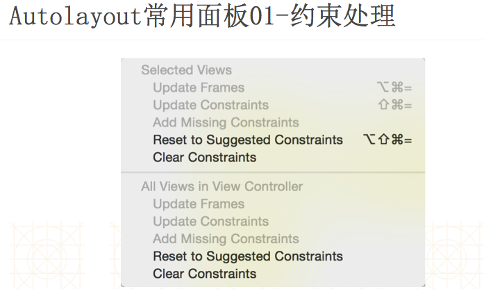
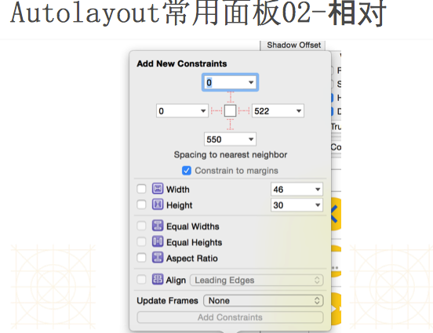
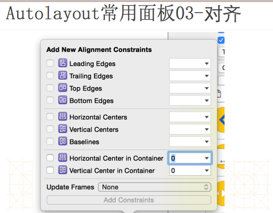
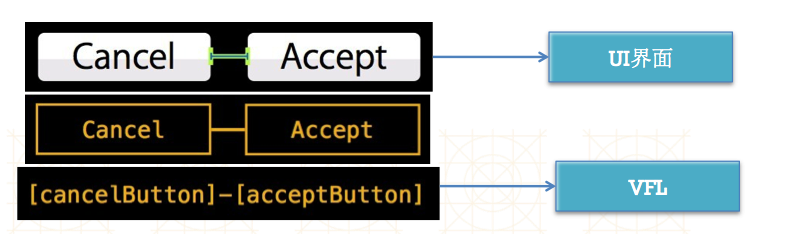

#AutoLayout

##autolayout的概念
- Autolayout是一种“自动布局”技术，专门用来布局UI界面的
Autolayout自iOS 6开始引入，由于Xcode 4的不给力，当时并没有得到很大推广
自iOS 7（Xcode 5）开始，Autolayout的开发效率得到很大的提升
苹果官方也推荐开发者尽量使用Autolayout来布局UI界面
Autolayout能很轻松地解决屏幕适配的问题





##autolayout的错误和警告
- 警告
 - 控件的frame不匹配所添加的约束, 比如
比如约束控件的宽度为100, 而控件现在的宽度是110

- 错误
 - 缺乏必要的约束, 比如只约束了宽度和高度, 没有约束具体的位置

 - 两个约束冲突, 比如,1个约束控件的宽度为100,1个约束控件的宽度为110
 - 
 

##代码实现autolayout
- 代码实现Autolayout的步骤
 - 利用NSLayoutConstraint类创建具体的约束对象
添加约束对象到相应的view上

```
- (void)addConstraint:(NSLayoutConstraint *)constraint;
- (void)addConstraints:(NSArray *)constraints;
```
- 代码实现Autolayout的注意点
- 要先禁止autoresizing功能，设置view的下面属性为NO
- view.translatesAutoresizingMaskIntoConstraints = NO;
- 添加约束之前，一定要保证相关控件都已经在各自的父控件上
不用再给view设置frame


- 一个NSLayoutConstraint对象就代表一个约束

 - 创建约束对象的常用方法
 
```
+(id)constraintWithItem:(id)view1 attribute:(NSLayoutAttribute)attr1 relatedBy:(NSLayoutRelation)relation toItem:(id)view2 attribute:(NSLayoutAttribute)attr2 multiplier:(CGFloat)multiplier constant:(CGFloat)c;

view1 ：要约束的控件
attr1 ：约束的类型（做怎样的约束）
relation ：与参照控件之间的关系
view2 ：参照的控件
attr2 ：约束的类型（做怎样的约束）
multiplier ：乘数
c ：常量
```

- 自动布局的核心计算公式
obj1.property1 =（obj2.property2 * multiplier）+ constant value


- 在创建约束之后，需要将其添加到作用的view上
- 在添加时要注意目标view需要遵循以下规则：
 - 1）对于两个同层级view之间的约束关系，添加到它们的父view上
 - 2）对于两个不同层级view之间的约束关系，添加到他们最近的共同父view上
 - 3）对于有层次关系的两个view之间的约束关系，添加到层次较高的父view上
 


##Vfl
- VFL全称是Visual Format Language，翻译过来是“可视化格式语言”
- VFL是苹果公司为了简化Autolayout的编码而推出的抽象语言
 



- VFL示例

```
- H:[cancelButton(72)]-12-[acceptButton(50)]
canelButton宽72，acceptButton宽50，它们之间间距12

H:[wideView(>=60@700)]
wideView宽度大于等于60point，该约束条件优先级为700（优先级最大值为1000，优先级越高的约束越先被满足）

V:[redBox][yellowBox(==redBox)]
竖直方向上，先有一个redBox，其下方紧接一个高度等于redBox高度的yellowBox

H:|-10-[Find]-[FindNext]-[FindField(>=20)]-|
水平方向上，Find距离父view左边缘默认间隔宽度，之后是FindNext距离Find间隔默认宽度；再之后是宽度不小于20的FindField，它和FindNext以及父view右边缘的间距都是默认宽度。（竖线“|” 表示superview的边缘）

```

- VFL使用

```
使用VFL来创建约束数组
+ (NSArray *)constraintsWithVisualFormat:(NSString *)format options:(NSLayoutFormatOptions)opts metrics:(NSDictionary *)metrics views:(NSDictionary *)views;
format ：VFL语句
opts ：约束类型
metrics ：VFL语句中用到的具体数值
views ：VFL语句中用到的控件

创建一个字典（内部包含VFL语句中用到的控件）的快捷宏定义
NSDictionaryOfVariableBindings(...)
```


- 第三方框架Masonry
    - 一般在调用方法前有Mas_的前缀,要省略必须在导入头文件前使用以下的宏定义
```objc
#define MAS_SHORTHAND
#define MAS_SHORTHAND_GLOBALS
```

    - 示例
```objc
        [iconImageView makeConstraints:^(MASConstraintMaker *make) {    
            make.left.top.equalTo(self.contentView).offset(margin);
            make.bottom.equalTo(self.contentView).offset(-margin);
            make.width.equalTo(80);
        }];
```
    - 示例  
    第一条约束表示控件距离contentView上和左的间距为margin
    
    第二条表示距离底部间距为margin       
    
    第三条表示宽度为80;
    
