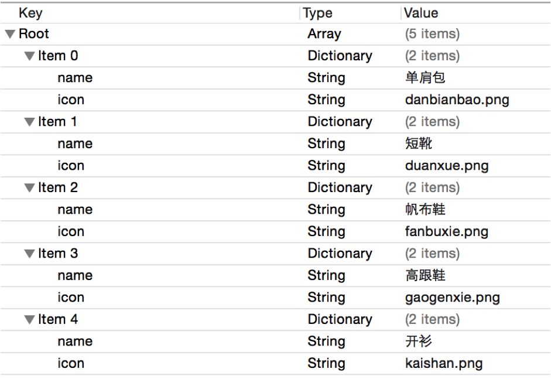

# 7.1 plist文件
- 概念
  - 直接将数据直接写在代码里面，不是一种合理的做法。如果数据经常改，就要经常翻开对应的代码进行修改，造成代码扩展性低

 - 因此，可以考虑将经常变的数据放在文件中进行存储，程序启动后从文件中读取最新的数据。如果要变动数据，直接修改数据文件即可，不用修改代码

 - 一般可以使用属性列表文件存储NSArray或者NSDictionary之类的数据，这种“属性列表文件”的扩展名是plist，因此也称为“plist文件”


##创建plist界面


##代码解析
- 获得Plist文件的全路径
```
NSBundle *bundle = [NSBundle mainBundle];
NSString *path = [bundle pathForResource:@"shops" ofType:@"plist"];
```
- 加载plist文件
```
_shops = [NSArray arrayWithContentsOfFile:path];
```

##plist解析过程



##plist使用注意
- plist的文件名不能叫做“info”、“Info”之类的

- 添加plist等文件资源的时候，一定要勾选下面的选项


# model
## 模型
- 概念
    - 专门用来`存放数据`的对象
- 特点
    - 一般直接继承自NSObject
    - 在.h文件中声明一些用来存放数据的属性
- 模型定义示例
```objc
@interface Shop : NSObject
/** 名字 */
@property (nonatomic, strong) NSString *name;
/** 图标 */
@property (nonatomic, strong) NSString *icon;
@end
```
- 字典转模型示例
```objc
Shop *shop = [[Shop alloc] init];
shop.name = dict[@"name"];
shop.icon = dict[@"icon"];
```

## 注释
```objc
// 单行注释
/* */ 多行注释
/** */ 文档注释
# The advantage for the model replace of the dictionary 用模型取代字典的好处

##使用字典的坏处
- 一般情况下，设置数据和取出数据都使用“字符串类型的key”，编写这些key时，编辑器没有智能提示，需要手敲
```
dict[@"name"] = @"Jack";
NSString *name = dict[@"name"];
```
- 手敲字符串key，key容易写错
Key如果写错了，编译器不会有任何警告和报错，造成设错数据或者取错数据

- 使用模型的好处
所谓模型，其实就是数据模型，专门用来存放数据的对象，用它来表示数据会更加专业

- 模型设置数据和取出数据都是通过它的属性，属性名如果写错了，编译器会马上报错，因此，保证了数据的正确性
使用模型访问属性时，编译器会提供一系列的提示，提高编码效率
```
app.name = @"Jack";
NSString *name = app.name;
```


##字典转模型
- 字典转模型的过程最好封装在模型内部

- 模型应该提供一个可以传入字典参数的构造方法
```
1通过一个字典来初始化模型对象  - (instancetype)initWithDict:(NSDictionary *)dict;
2 通过一个字典来创建模型对象         + (instancetype)xxxWithDict:(NSDictionary *)dict;
```

##字典转模型的过程

