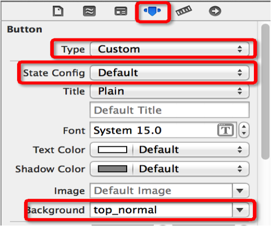
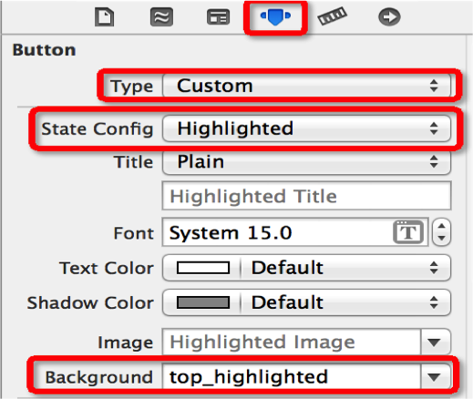
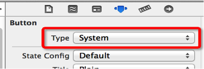
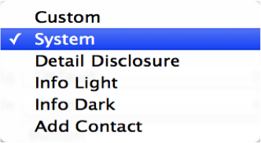

## contentMode属性
- 带有scale单词的：图片有可能会拉伸
    - UIViewContentModeScaleToFill
        - 将图片拉伸至填充整个imageView
        - 图片显示的尺寸跟imageView的尺寸是一样的
    - 带有aspect单词的：保持图片原来的宽高比
        - UIViewContentModeScaleAspectFit
            - 保证刚好能看到图片的全部
        - UIViewContentModeScaleAspectFill
            - 拉伸至图片的宽度或者高度跟imageView一样

- 没有scale单词的：图片绝对不会被拉伸，保持图片的原尺寸
    - UIViewContentModeCenter
    - UIViewContentModeTop
    - UIViewContentModeBottom
    - UIViewContentModeLeft
    - UIViewContentModeRight
    - UIViewContentModeTopLeft
    - UIViewContentModeTopRight
    - UIViewContentModeBottomLeft
    - UIViewContentModeBottomRight
## 小语法点
- 不能直接修改：OC对象的结构体属性的成员
- 下面的写法是错误的

```objc
imageView.frame.size = imageView.image.size;
```
- 正确写法

```objc
//在OC中对象结构体成员的修改,可以创建一个临时的结构体来取值
CGRect tempFrame = imageView.frame;
tempFrame.size = imageView.image.size;
imageView.frame = tempFrame;
```

## initWithImage:方法
- 利用这个方法创建出来的imageView的尺寸和传入的图片尺寸一样

## 修改frame的3种方式
- 直接使用CGRectMake函数

```objc
imageView.frame = CGRectMake(100, 100, 200, 200);
```
- 利用临时结构体变量

```objc
CGRect tempFrame = imageView.frame;
tempFrame.origin.x = 100;
tempFrame.origin.y = 100;
tempFrame.size.width = 200;
tempFrame.size.height = 200;
imageView.frame = tempFrame;
```

- 使用大括号{}形式

```objc
imageView.frame = (CGRect){{100, 100}, {200, 200}};
```

- 抽取重复代码
    - 将相同代码放到一个新的方法中
    - 不用的东西就变成方法的参数

- 图片的加载方式
    - 有缓存
    ```objc
    UIImage *image = [UIImage imageNamed:@"图片名"];
    ```
        - 使用场合：图片比较小、使用频率较高
        - 建议把需要缓存的图片直接放到Images.xcassets
    - 无缓存
    ```objc
    NSString *file = [[NSBundle mainBundle] pathForResource:@"图片名" ofType:@"图片的扩展名"];
    UIImage *image = [UIImage imageWithContentsOfFile:@"图片文件的全路径"];
    ```
        - 使用场合：图片比较大、使用频率较小
        - 不需要缓存的图片不能放在Images.xcassets
    - 放在Images.xcassets里面的图片，只能通过图片名去加载图片

- 延迟做一些事情

```objc
[abc performSelector:@selector(stand:) withObject:@"123" afterDelay:10];
// 10s后自动调用abc的stand:方法，并且传递@"123"参数
```

- 音频文件的简单播放

```objc
// 创建一个音频文件的URL(URL就是文件路径对象)
NSURL *url = [[NSBundle mainBundle] URLForResource:@"音频文件名" withExtension:@"音频文件的扩展名"];
// 创建播放器
self.player = [AVPlayer playerWithURL:url];
// 播放
[self.player play];
```


##UIImageView的常见属性
```
@property(nonatomic,retain) UIImage *image;
显示的图片

@property(nonatomic,copy) NSArray *animationImages;
显示的动画图片

@property(nonatomic) NSTimeInterval animationDuration;
动画图片的持续时间

@property(nonatomic) NSInteger      animationRepeatCount;
动画的播放次数（默认是0，代表无限播放）

```
##UIImageView的常见方法
```
- (void)startAnimating; // 开始动画
- (void)stopAnimating; // 停止动画
- (BOOL)isAnimating; // 是否正在执行动画

```

##UIImage
- 一个UIImage对象代表一张图片，一般通过imageNamed:方法就可以通过文件名加载项目中的图片
- 例子

```obj
UIImage *image = [UIImage imageNamed:@"lufy"];

```

# UILabel
- 设置显示多少行,要想显示所有的行数,设置为0


```
    label.numberOfLines = 2;
```


```obj
@property(nonatomic,copy)   NSString           *text;
显示的文字

@property(nonatomic,retain) UIFont             *font;
字体

@property(nonatomic,retain) UIColor            *textColor;
文字颜色

@property(nonatomic)        NSTextAlignment    textAlignment;
对齐模式（比如左对齐、居中对齐、右对齐）

@property(nonatomic) NSInteger numberOfLines;
文字行数

@property(nonatomic)        NSLineBreakMode    lineBreakMode;
换行模式
```


#UIFront
UIFont代表字体，常见创建方法有以下几个：
-  1系统默认字体 + (UIFont *)systemFontOfSize:(CGFloat)fontSize;
-  2粗体         + (UIFont *)boldSystemFontOfSize:(CGFloat)fontSize;
-  3斜体         +   (UIFont *)italicSystemFontOfSize:(CGFloat)fontSize;


- 可以不用记,当需要时,要学会自学,跳到头文件中,查看就可以,不懂的可以自己动手测试出来

# UIButton
##UIbutton的状态
- normal（普通状态）
- 默认情况（Default）
- 对应的枚举常量：UIControlStateNormal


- highlighted（高亮状态）
- 按钮被按下去的时候（手指还未松开）
- 对应的枚举常量：UIControlStateHighlighted

- disabled（失效状态，不可用状态）
- 如果enabled属性为NO，就是处于disable状态，代表按钮不可以被点击
- 对应的枚举常量：UIControlStateDisabled

##设置按钮在不同状态的背景图片




##按钮的样式

- 
- 


##UIButton的常见设置
```
- (void)setTitle:(NSString *)title forState:(UIControlState)state;
设置按钮的文字

- (void)setTitleColor:(UIColor *)color forState:(UIControlState)state;
设置按钮的文字颜色

- (void)setImage:(UIImage *)image forState:(UIControlState)state;
设置按钮内部的小图片

- (void)setBackgroundImage:(UIImage *)image forState:(UIControlState)state;
设置按钮的背景图片


btn.titleLabel.font = [UIFont systemFontOfSize:13];
设置按钮的文字字体（需要拿到按钮内部的label来设置）

- (NSString *)titleForState:(UIControlState)state;
获得按钮的文字

- (UIColor *)titleColorForState:(UIControlState)state;
获得按钮的文字颜色

- (UIImage *)imageForState:(UIControlState)state;
获得按钮内部的小图片

- (UIImage *)backgroundImageForState:(UIControlState)state;
获得按钮的背景图片


```

#  choose for the  UIImageView and UILabel and UIButton
## UIButton、UIImageView、UILabel的选择
- 选择
- 仅仅是显示数据，不需要点击
- 建议选择UIImageView、UILabel

- 不仅显示数据，还需要监听点击
- 建议选择UIButton
- 其实UIImageView、UILabel也可以通过手势识别器来监听

- 长按控件后，会改变显示的内容
- 不用考虑了，选择UIButton（因为UIButton有highlighted这种状态）

- 同时显示2张图片：背景图片、内容图片
- 不用考虑了，选择UIButton
