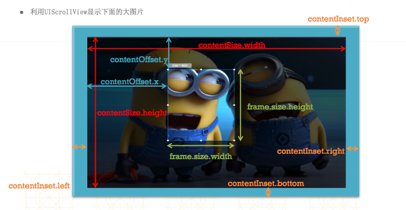
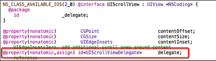
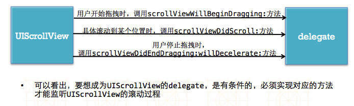
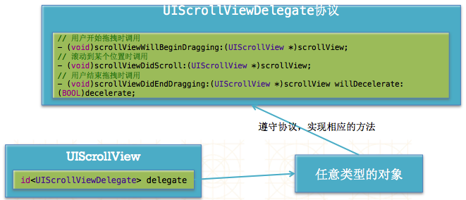
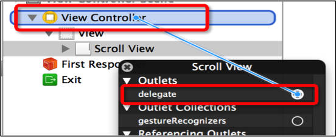
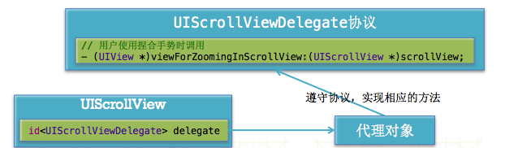

#UIScrollView
##What is scrollVIew
- 移动设备的屏幕大小是极其有限的，因此直接展示在用户眼前的内容也相当有限
当展示的内容较多，超出一个屏幕时，用户可通过滚动手势来查看屏幕以外的内容
普通的UIView不具备滚动功能，不适合显示过多的内容
UIScrollView是一个能够滚动的视图控件，可以用来展示大量的内容，并且可以通过滚动查看所有的内容
举例：手机上的“设置

##UIScrollView基本使用
- UIScrollView的用法很简单
将需要展示的内容添加到UIScrollView中,设置UIScrollView的contentSize属性，告诉UIScrollView所有内容的尺寸，也就是告诉它滚动的范围（能滚多远，滚到哪里是尽头）

- UIScrollView显示内容的小细节
超出UIScrollView边框的内容会被自动隐藏
用户可以用过手势拖动来查看超出边框并被隐藏的内容


- 如果UIScrollView无法滚动，可能是以下原因：
- 没有设置contentSize  scrollEnabled = NO
- 没有接收到触摸事件:userInteractionEnabled = NO


##UIScrollView的常见属性

```obj

@property(nonatomic) CGPoint contentOffset; 
这个属性用来表示UIScrollView滚动的位置
（其实就是内容左上角与scrollView左上角的间距值）

@property(nonatomic) CGSize contentSize; 
这个属性用来表示UIScrollView内容的尺寸，滚动范围（能滚多远）

@property(nonatomic) UIEdgeInsets contentInset; 
这个属性能够在UIScrollView的4周增加额外的滚动区域，一般用来避免scrollView的内容被其他控件挡住
```




##UIScrollView的其他属性
```obj

@property(nonatomic) BOOL bounces;
设置UIScrollView是否需要弹簧效果

@property(nonatomic,getter=isScrollEnabled) BOOL scrollEnabled; 
设置UIScrollView是否能滚动

@property(nonatomic) BOOL showsHorizontalScrollIndicator;
是否显示水平滚动条

@property(nonatomic) BOOL showsVerticalScrollIndicator;
是否显示垂直滚动条
```


##UIScrollView的dekegate

- 我们想在UIScrollView正在滚动 或 滚动到某个位置 或者 停止滚动 时做一些特定的操作,要想完成上述功能，前提条件就是能够监听到UIScrollView的整个滚动过程

- 当UIScrollView发生一系列的滚动操作时， 会自动通知它的代理（delegate）对象，给它的代理发送相应的消息，让代理得知它的滚动情况,也就是说，要想监听UIScrollView的滚动过程，就必须先给UIScrollView设置一个代理对象，然后通过代理得知UIScrollView的滚动过程




##UIScrollView和delegate的通信



##成为delegate的条件
- UIScrollView将delegate需要实现的方法都定义在了UIScrollViewDelegate协议中，因此要想成为UIScrollView的delegate，必须遵守UIScrollViewDelegate协议，然后实现协议中相应的方法，就可以监听UIScrollView的滚动过程了




##UIScrollView的和控制器
- 一般情况下，就设置UIScrollView所在的控制器为UIScrollView的delegate
- 设置控制器为UIScrollView的delegate有2种方法：
 - 通过代码（self就是控制器）
```   
self.scrollView.delegate = self;
```
 - 通过storyboard拖线
 


##UIScorllView的缩放原理
- 当用户在UIScrollView身上使用捏合手势时，UIScrollView会给代理发送一条消息，询问代理究竟要缩放自己内部的哪一个子控件（哪一块内容）

- 当用户在UIScrollView身上使用捏合手势时，UIScrollView会调用代理的viewForZoomingInScrollView:方法，这个方法返回的控件就是需要进行缩放的控件


- 缩放的步骤
  - 设置UIScrollView的id<UISCrollViewDelegate> delegate代理对象
 - 设置minimumZoomScale ：缩小的最小比例
 - 设置maximumZoomScale ：放大的最大比例
 - 让代理对象实现下面的方法，返回需要缩放的视图
 
```
- (UIView *)viewForZoomingInScrollView:(UIScrollView *)scrollView;

跟缩放相关的其他代理方法
缩放完毕的时候调用 
- (void)scrollViewWillBeginZooming:(UIScrollView *)scrollView withView:(UIView *)view

正在缩放的时候调用
- (void)scrollViewDidZoom:(UIScrollView *)scrollView
```


##分页

- 只要将UIScrollView的pageEnabled属性设置为YES，UIScrollView会被分割成多个独立页面，里面的内容就能进行分页展示

 -  一般会配合UIPageControl增强分页效果，UIPageControl常用属性-如下
```
一共有多少页
@property(nonatomic) NSInteger numberOfPages;
当前显示的页码
@property(nonatomic) NSInteger currentPage; 
只有一页时，是否需要隐藏页码指示器
@property(nonatomic) BOOL hidesForSinglePage; 
其他页码指示器的颜色
@property(nonatomic,retain) UIColor *pageIndicatorTintColor;
当前页码指示器的颜色
@property(nonatomic,retain) UIColor *currentPageIndicatorTintColor;
```


##NSTimer
- NSTimer叫做“定时器”，它的作用如下
在指定的时间执行指定的任务
每隔一段时间执行指定的任务

调用下面的方法就会开启一个定时任务
```
+ (NSTimer *)scheduledTimerWithTimeInterval:(NSTimeInterval)ti 		target:(id)aTarget 
	selector:(SEL)aSelector 
	userInfo:(id)userInfo 
	repeats:(BOOL)yesOrNo;
每隔ti秒，调用一次aTarget的aSelector方法，yesOrNo决定了是否重复执行这个任务
```
- 通过invalidate方法可以停止定时器的工作，一旦定时器被停止了，就不能再次执行任务。只能再创建一个新的定时器才能执行新的任务

```
- (void)invalidate;
```

- 解决定时器在主线程不工作的问题
```
NSTimer *timer = [NSTimer timerWithTimeInterval:2 target:self selector:@selector(next) userInfo:nil repeats:YES];
[[NSRunLoop mainRunLoop] addTimer:timer forMode:NSRunLoopCommonModes];
```

## 监听scrollView各种行为的3大步骤（比如让控制器监听scrollView的行为）
- 设置scrollView的delegate（代理）为控制器对象

```objc
scrollView.delegate = 控制器;
```

- 控制器要遵守UIScrollViewDelegate协议

```objc
@interface 控制器 ()  <UIScrollViewDelegate>

@end
```

- 控制器要实现UIScrollViewDelegate协议里面的代理方法

```objc
#pragma mark - <UIScrollViewDelegate>  代理方法
/**
 *  只要scrollView在滚动，就会调用这个方法（监听scrollView的滚动）
 */
- (void)scrollViewDidScroll:(UIScrollView *)scrollView
{
    NSLog(@"scrollViewDidScroll");
}
```

## 代理使用的一般规律
- 作用：用来监听控件的某些行为
- 代理：是控制器对象
- 代理：是id类型，并且是弱指针
- 代理协议的格式：控件类名Delegate，比如UIScrollViewDelegate、UITextFieldDelegate
- 代理方法：方法名一般是控件名开头，比如UIScrollView的代理方法一般以scrollView开头

## 如何监听控件的行为
- 通过addTarget:
    - 只有继承自UIControl的控件，才有这个功能
    - UIControlEventTouchUpInside : 点击事件（UIButton）
    - UIControlEventValueChanged : 值改变事件（UISwitch、UISegmentControl、UISlider）
    - UIControlEventEditingChanged : 文字改变事件（UITextField）
- 通过delegate
    - 只有拥有delegate属性的控件，才有这个功能

## NSTimer的使用
- 开启定时器

```objc
@property (nonatomic, weak) NSTimer *timer;

// 返回一个自动开始执行任务的定时器
self.timer = [NSTimer scheduledTimerWithTimeInterval:2.0 target:self selector:@selector(nextPage:) userInfo:@"123" repeats:YES];

// 修改NSTimer在NSRunLoop中的模式：NSRunLoopCommonModes
// 主线程不管在处理什么操作，都会抽时间处理NSTimer
[[NSRunLoop mainRunLoop] addTimer:self.timer forMode:NSRunLoopCommonModes];
```
- 关闭定时器

```objc
[self.timer invalidate];
```