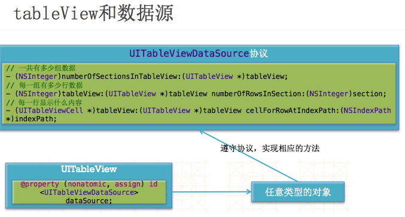
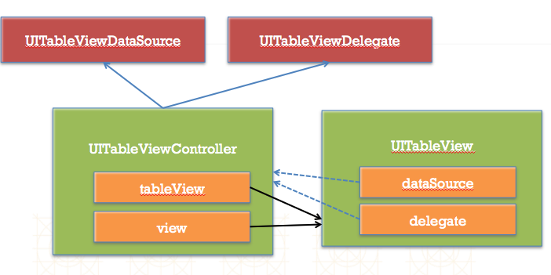
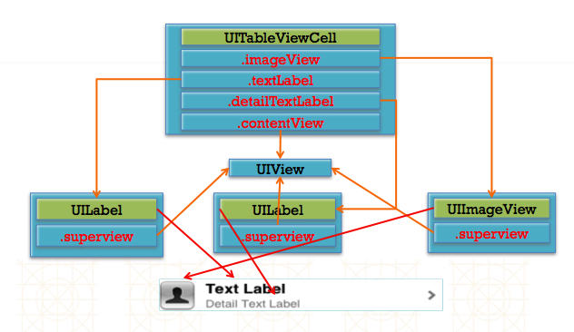

#UITableView

- 设置数据源对象

```objc
self.tableView.dataSource = self;
```

- 数据源对象要遵守协议

```objc
@interface ViewController () <UITableViewDataSource>

@end
```

- 实现数据源方法

```objc
// 多少组数据
- (NSInteger)numberOfSectionsInTableView:(UITableView *)tableView;

// 每一组有多少行数据
- (NSInteger)tableView:(UITableView *)tableView numberOfRowsInSection:(NSInteger)section;

// 每一行显示什么内容
- (UITableViewCell *)tableView:(UITableView *)tableView cellForRowAtIndexPath:(NSIndexPath *)indexPath;

// 每一组的头部
- (NSString *)tableView:(UITableView *)tableView titleForHeaderInSection:(NSInteger)section;

// 每一组的尾部
- (NSString *)tableView:(UITableView *)tableView titleForFooterInSection:(NSInteger)section
```




## tableView的常见设置
```objc
// 设置每一行cell的高度
self.tableView.rowHeight = 100;

// 设置每一组头部的高度
self.tableView.sectionHeaderHeight = 50;

// 设置每一组尾部的高度
self.tableView.sectionFooterHeight = 50;

// 设置分割线颜色
self.tableView.separatorColor = [UIColor redColor];
// 设置分割线样式
self.tableView.separatorStyle = UITableViewCellSeparatorStyleNone;
// 设置表头控件
self.tableView.tableHeaderView = [[UISwitch alloc] init];
// 设置表尾控件
self.tableView.tableFooterView = [UIButton buttonWithType:UIButtonTypeContactAdd];

// 设置右边索引文字的颜色
self.tableView.sectionIndexColor = [UIColor redColor];
// 设置右边索引文字的背景色
self.tableView.sectionIndexBackgroundColor = [UIColor blackColor];
```


##cell的简介
- UITableView的每一行都是一个UITableViewCell，通过dataSource的tableView:cellForRowAtIndexPath:方法来初始化每一行

- UITableViewCell内部有个默认的子视图:contentView，contentView是UITableViewCell所显示内容的父视图，可显示一些辅助指示视图

- 辅助指示视图的作用是显示一个表示动作的图标，可以通过设置UITableViewCell的accessoryType来显示，默认是UITableViewCellAccessoryNone(不显示辅助指示视图)，其他值如下:
UITableViewCellAccessoryDisclosureIndicator
UITableViewCellAccessoryDetailButton
UITableViewCellAccessoryDetailDisclosureButton
UITableViewCellAccessoryCheckmark
还可以通过cell的accessoryView属性来自定义辅助指示视图（比如往右边放一个开关）


##UITableViewCell的contentView
- contentView下默认有3个子视图
其中2个是UILabel(通过UITableViewCell的textLabel和detailTextLabel属性访问)
第3个是UIImageView(通过UITableViewCell的imageView属性访问)
UITableViewCell还有一个UITableViewCellStyle属性，用于决定使用contentView的哪些子视图，以及这些子视图在contentView中的位置


##UITableViewCell的结构



##UITableViewCell重用
- 还有一个非常重要的问题：有时候需要自定义UITableViewCell(用一个子类继承UITableViewCell)，而且每一行用的不一定是同一种UITableViewCell，所以一个UITableView可能拥有不同类型的UITableViewCell，对象池中也会有很多不同类型的UITableViewCell，那么UITableView在重用UITableViewCell时可能会得到错误类型的UITableViewCell

- 解决方案：UITableViewCell有个NSString *reuseIdentifier属性，可以在初始化UITableViewCell的时候传入一个特定的字符串标识来设置reuseIdentifier(一般用UITableViewCell的类名)。当UITableView要求dataSource返回UITableViewCell时，先通过一个字符串标识到对象池中查找对应类型的UITableViewCell对象，如果有，就重用，如果没有，就传入这个字符串标识来初始化一个UITableViewCell对象

- cell的重用代码实现

```
- (UITableViewCell *)tableView:(UITableView *)tableView cellForRowAtIndexPath:(NSIndexPath *)indexPath
{
    // 1.定义一个cell的标识
      static NSString *ID = @”czcell";
    
    // 2.从缓存池中取出cell
      UITableViewCell *cell = [tableView dequeueReusableCellWithIdentifier:ID];
    
    // 3.如果缓存池中没有cell
      if (cell == nil) {
        cell = [[UITableViewCell alloc] initWithStyle:UITableViewCellStyleSubtitle reuseIdentifier:ID];
    }
    ```
    
## cell的循环利用
- 传统的写法

```objc
/**
 *  每当有一个cell要进入视野范围内，就会调用一次
 */
- (UITableViewCell *)tableView:(UITableView *)tableView cellForRowAtIndexPath:(NSIndexPath *)indexPath
{
    static NSString *ID = @"wine";

    // 1.先去缓存池中查找可循环利用的cell
    UITableViewCell *cell = [tableView dequeueReusableCellWithIdentifier:ID];

    // 2.如果缓存池中没有可循环利用的cell
    if (!cell) {
        cell = [[UITableViewCell alloc] initWithStyle:UITableViewCellStyleDefault reuseIdentifier:ID];
    }

    // 3.设置数据
    cell.textLabel.text = [NSString stringWithFormat:@"%zd行的数据", indexPath.row];

    return cell;
}
```

- 新的写法（注册cell）

```objc
NSString *ID = @"wine";

- (void)viewDidLoad {
    [super viewDidLoad];

    // 注册某个重用标识 对应的 Cell类型
    [self.tableView registerClass:[UITableViewCell class] forCellReuseIdentifier:ID];
}

- (UITableViewCell *)tableView:(UITableView *)tableView cellForRowAtIndexPath:(NSIndexPath *)indexPath
{
    // 1.先去缓存池中查找可循环利用的cell
    UITableViewCell *cell = [tableView dequeueReusableCellWithIdentifier:ID];

    // 2.设置数据
    cell.textLabel.text = [NSString stringWithFormat:@"%zd行的数据", indexPath.row];

    return cell;
}
```

##通过代码自定义cell(cell的高度不一致)
- 1.新建一个继承自UITableViewCell的类
- 2.重写initWithStyle:reuseIdentifier:方法
添加所有需要显示的子控件(不需要设置子控件的数据和frame, 子控件要添加到contentView中)
进行子控件一次性的属性设置(有些属性只需要设置一次, 比如字体\固定的图片)
- 3.提供2个模型
 - 数据模型: 存放文字数据\图片数据
 - frame模型: 存放数据模型\所有子控件的frame\cell的高度
- 4.cell拥有一个frame模型(不要直接拥有数据模型)
- 5.重写frame模型属性的setter方法: 在这个方法中设置子控件的显示数据和frame
- 6.frame模型数据的初始化已经采取懒加载的方式(每一个cell对应的frame模型数据只加载一次)