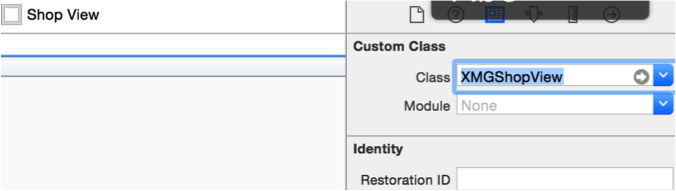

#  View的封装
- 如果一个view内部的子控件比较多，一般会考虑自定义一个view，把它内部子控件的创建屏蔽起来，不让外界关心

- 外界可以传入对应的模型数据给view，view拿到模型数据后给内部的子控件设置对应的数据

- 封装控件的基本步骤
 - 在initWithFrame:方法中添加子控件，提供便利构造方法
 - 在layoutSubviews方法中设置子控件的frame（一定要调用super的layoutSubviews）
 - 增加模型属性，在模型属性set方法中设置数据到子控件上

## 通过纯代码自定义控件
- 继承自系统自带的控件，写一个属于自己的控件
- 目的：封装控件内部的细节，不让外界关心
- 步骤
    - 新建一个继承`UIView`的类
    - 在`initWithFrame:`方法中添加子控件
    - 在`layoutSubviews`方法中设置子控件的frame
        - 一定要调用`[super layoutSubviews]`;
    - 提供一个模型属性，重写模型属性的set方法
        - 在set方法中取出模型属性，给对应的子控件赋值


# XIB

##XIb概念
 - 描述一个局部的UI界面

#xib的代码加载
- 方法1
 - ```
NSArray *views = [[NSBundle mainBundle] loadNibNamed:@"xib文件名" owner:nil options:nil]
``

- 方法2
```
UINib *nib = [UINib nibWithNibName:@"xib文件名" bundle:nil];
NSArray *views = [nib instantiateWithOwner:nil options:nil];
```

##使用xib自定义view的步骤
- 新建自定义控件类

- 新建xib文件（文件名建议和view的类名一致）


- 修改xib中view的类名


- 封装xib的加载过程


- 增加模型属性，在模型属性set方法中设置数据到子控件上


## 通过xib自定义控件
- 新建一个继承`UIView`的类
- 新建一个xib文件（xib的文件名最好跟控件类名一样）
    - 添加子控件、设置子控件属性
    - 修改最外面那个控件的class为控件类名
    - 将子控件进行连线
- 提供模型属性，重写模型的set方法
    - 在set方法中给子控件设置数据


##注意点
- 一个控件有2种创建方式
 - 通过代码创建
 - 初始化时一定会调用initWithFrame:方法

- 通过xib\storyboard创建
 - 初始化时不会调用initWithFrame:方法，只会调用initWithCoder:方法
 - 初始化完毕后会调用awakeFromNib方法

- 有时候希望在控件初始化时做一些初始化操作，比如添加子控件、设置基本属性,这时需要根据控件的创建方式，来选择在initWithFrame:、initWithCoder:、awakeFromNib的哪个方法中操作


##Xib和storyboard对比
- 共同点：
 - 都用来描述软件界面
 - 都用Interface Builder工具来编辑
 - 本质都是转换成代码去创建控件

- 不同点
 - Xib是轻量级的，用来描述局部的UI界面
 - Storyboard是重量级的，用来描述整个软件的多个界面，并且能展示多个界面之间的跳转关系